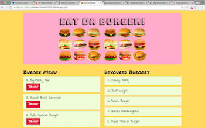

# Eat Da Burger

## About the Application
Eat the burger is a simple full-stack application utilizing the MVC design pattern.  It uses HTML/Bootstrap/CSS to handle the front-end of the application and Node.js and Express to implement the back-end.  HTML templating is done with the help of Handlebars.  This app also uses ORM to let you query and manipulate data from the MySQL database.



## Instructions
The user can enter the name of a burger into the text box and click Submit to add the burger to the Burger Menu.  If the user would like to devour it, then they would click the "Devour" button.  The devoured burger will then be displayed under the Devoured Burger column.  The devoured status will then be updated accordingly in MySQL/JawsDB.

## Demo
Demo can be found [right here](https://shielded-hamlet-17331.herokuapp.com/)

## Installation
1. To run the app locally, git clone this repository with git clone:
```git clone https://github.com/natgonzalezrosa/burger.git```

2. Then you will need to install all of the dependencies (express, mysql, etc.):
```npm install```

3. Run the server locally:
```node server.js```

4. Open the local application on PORT 3000 at: http://localhost:3000/

[cat chasing burger](https://i2.wp.com/38.media.tumblr.com/tumblr_lml1dqeMSE1qzoxyvo1_500.gif)
